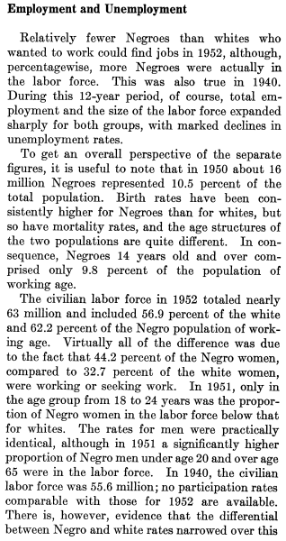
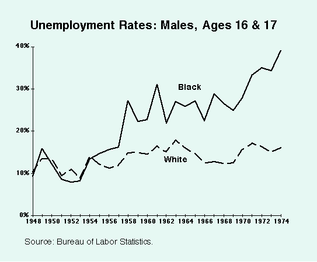
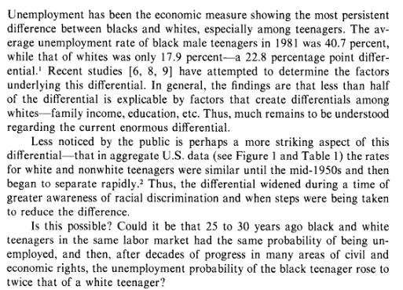
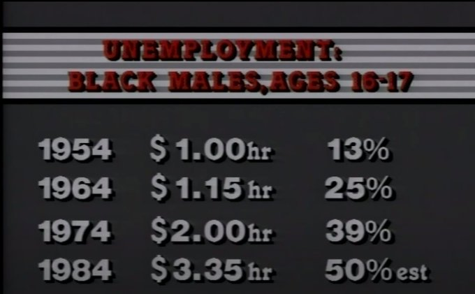
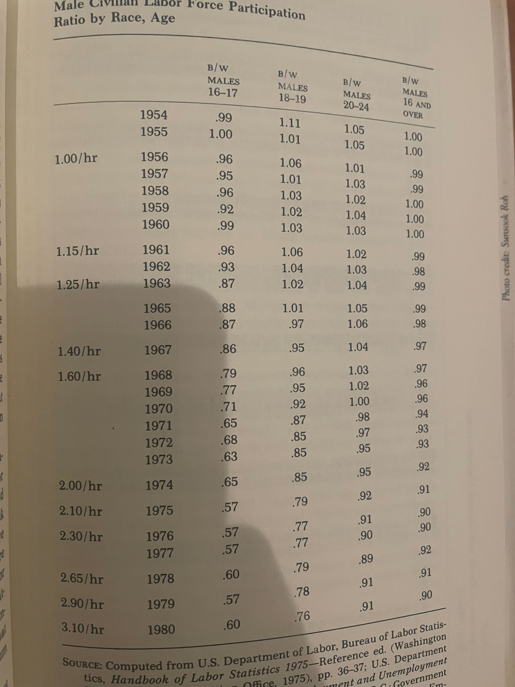

# Minimum Wage Effects on Minority Teens

Excerpt from Bureau of Labor and Statistics paper on employment rates
of blacks and whites between 1940 and 1952, published in 1953.
Black male and white male employment rates as a percent of population
are "virtually" equal.

Immediately after, the rates of unemployment of black male teenagers
diverges, and black males in general but to a lesser degree than
teenagers specifically.

Federal paper from 1983 wondering how on earth this could be? What
happened in 1954 to kick off such a huge change?

Chart from Walter Williams' documentary Good Intentions (https://www.youtube.com/watch?v=L5TS8QUJWXo)

Chart from Walter Williams' book The State Against Blacks

Today, black male teenager unemployment is consistently twice as high as
white male teenager unemployment and has been since the mid-80s.

https://civilrights.org/edfund/resource/the-crisis-of-black-teenage-unemployment/

https://www.brookings.edu/blog/the-avenue/2021/08/09/julys-jobs-report-shows-black-teens-struggling-with-the-highest-unemployment-rate/

The UK (hardly a society of free market ideals) sees this problem quite clearly. Minimum wage is tiered based on age. 

https://minimumwage.blog.gov.uk/2020/03/09/why-do-young-people-have-lower-minimum-wages/

Take this into account with the fact that the labor force participation rate of young workers in the UK is consistently higher than the US. Unemployed teens become underemployed adults.

